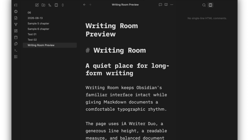

# Writing Room

Writing Room is a deliberately minimal Obsidian theme for long-form writing.

Obsidian stays Obsidian: the native interface, colors, navigation, tabs, panels, menus, settings, and plugin surfaces remain unchanged. Inside Markdown documents, Writing Room uses iA Writer Duo with a comfortable line height, readable line width, and generous document margins.

## What changes

- iA Writer Duo in Markdown editing and Reading View
- Document line height of `1.7`
- Readable line width of `800px`
- Document margins of `64px 32px 32px`

Writing Room preserves the user's Obsidian font-size setting and Obsidian Default's paragraph spacing, heading hierarchy, heading weights, colors, backgrounds, links, lists, blockquotes, callouts, and checkboxes.

## Installation

Create a `Writing Room` folder inside your vault's `.obsidian/themes` directory and copy these files into it:

- `theme.css`
- `manifest.json`

In Obsidian, open **Settings → Appearance → Themes** and select **Writing Room**.

## Font credit and license

Writing Room embeds WOFF2 conversions of the original, unmodified iA Writer Duo variable fonts from the [iA Fonts project](https://github.com/iaolo/iA-Fonts) directly in `theme.css`, making the distributed theme self-contained and available offline. The source TTF and converted WOFF2 files are retained in [`fonts`](fonts) for transparency and reproducible packaging.

The fonts are licensed under the SIL Open Font License 1.1. The complete license and copyright notices are included both in [`fonts/LICENSE.md`](fonts/LICENSE.md) and in the distributed `theme.css`.

iA Writer Duo and iA Writer are associated with Information Architects Inc. Writing Room is an independent project and is not affiliated with, sponsored by, or endorsed by Information Architects Inc. or iA Writer.

## License

Writing Room's original theme code and documentation are released under the MIT License. The bundled fonts remain subject to the SIL Open Font License 1.1.
